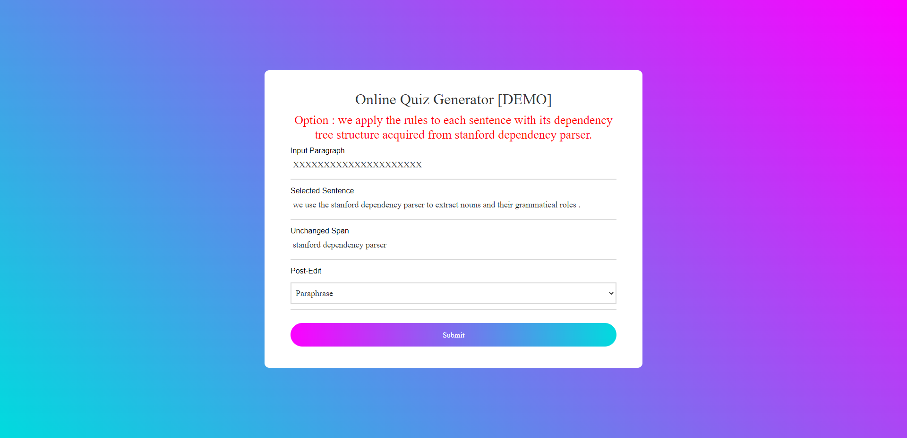

# P2MCQ Deployment

Simin Olivia Fan | oliviaaa@umich.edu

---

## Page Preview

### Connection

- Can be access on any devices everywhere! 
- No VPN requirement ***(tested in U.S. and China)***.
- http://52.91.191.29:8080/

### Test

- Components
  - Input Paragraph: user selected paragraph, used only for summarization model;
  - Selected Sentence: single sentence for paraphrase and simplification;
  - Unchanged Span: a single word/phrase the user want to keep unchanged in paraphrase/simplification.
  - Post-Edit: Edit options (Paraphrase, Simplification, Summarization, Negation).
- Sample
  - Input Paragraph: (blank); => *summarization model has not been implemented*
  - Selected Sentence: `we use the stanford dependency parser to extract nouns and their grammatical roles .`;
  - Unchanged Span: `stanford dependency parser`.

### Deployment Details

- Platform: AWS
- Instance Type:  EC2  ||  t2.2xlarge (8 vCPU, 32 GiB RAM)
- Cost: 
  - Linux: 0.3712 USD/h
  - Windows: 0.4332 USD/h

---

